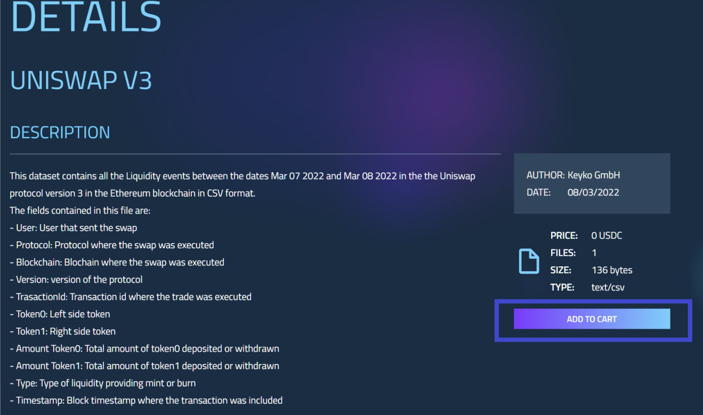
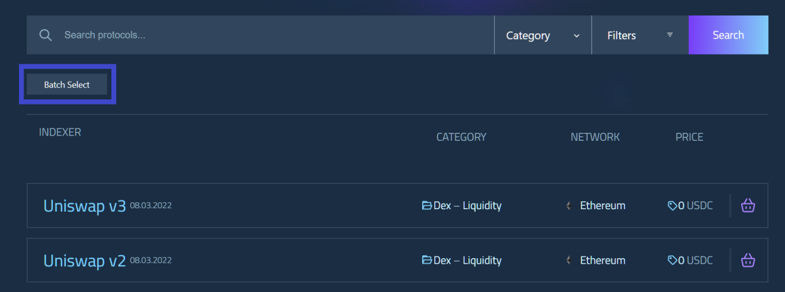
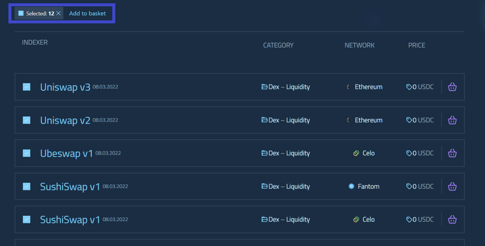
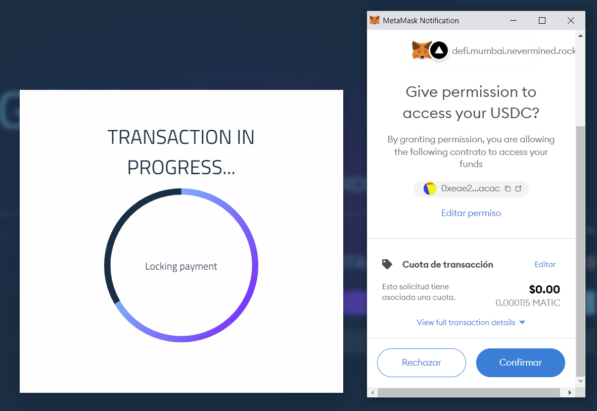
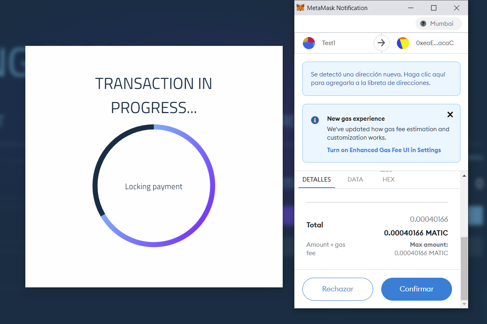
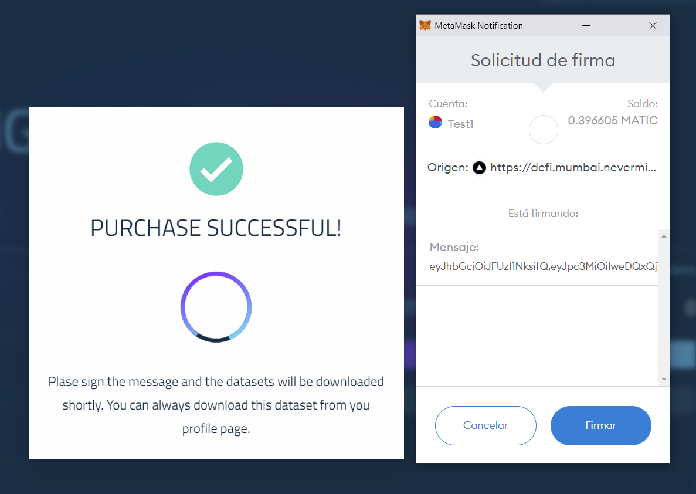

# How to use the DeFi Data Marketplace
This marketplace allows search, shop and download DeFi data using a simple web application or a command-line interface. This guide will explain how to use the web application to download DeFi Data, to use the command line interface follow [this guide](https://defi.mumbai.nevermined.rocks/cli)

## Searching datasets
In order to find the dataset to download, the search bar can be used, searching for a specific protocol or using the filters to find the type of event that you are interested in. This search bar can be found at the top of the page. 

To filter the data, several filters can be applied. In order to find the event type that we're looking for, the category filter can be used. With it, we can specify which specific type of event we want to search for. These events are the different types of user interactions that are currently supported in the marketplace. 

Also, other advanced filters can be used, to only return datasets that cames from a specific blockchain, publication date or based on the price. 

## Buying datasets
Once we know which datasets we want to download, we need to add them to the shopping cart. There are several ways to do it: 

- Adding the dataset from the search list.
When the search list is returned all the datasets will have an icon at the right to directly add the dataset to the shopping cart

- Adding the dataset from the dataset detail.
When the search list is returned all the datasets each dataset can be clicked individually to see the dataset details. On this detail page, all the fields contained are listed and a sample file can be downloaded. To add this specific dataset to the shopping cart, just click the add to cart button.

- Adding several datasets with batch selection
When the search list is returned, several datasets be added to the cart at the same time using the "Batch Select" feature once it is activated. All the datasets in the list can be added by clicking the top check.  

## Downloading datasets
Once we have all the assets that we want to download in the shopping cart, we can start the purchase process. To complete this process please check first that your wallet is configured as described [here](./Payment.md)

The purchase process has several steps

### Bundle creation
When all the assets are in the shopping cart the marketplace needs to create a package with all of them (a bundle) to download all of them at once. This process will start when the purchase button is clicked and the confirmation accepted. When this process will start a popup like this will be shown:

This process can take some time, depending on the number of assets in the shopping cart and the number of requests sent by other users, if the process takes more than expected a popup like this will inform that there are too many requests and will be created as soon as possible, the package will be shown in your profile when it's ready and the purchase flow can be started. 

If the bundle was created successfully this popup will appear, starting the purchase process. 

### Purchase process
The purchase process has some interactions with the blockchain, sending some transactions to create an agreement and do the payment.

This process starts with the agreement creation, this is the way that nevermined allows to retrieve the data. An agreement is created and then payment is sent to fulfill this agreement and grant access to the data. To do so, first, we need to send a transaction to create the agreement:

After this agreement is created the payment should be done, this is a two-step process.
First, it is necessary to allow DeFi Marketplace to spent your tokens:

When the allowance transactions are confirmed the tokens can be sent locking the payment for this agreement.

After the payment is done, the assets are available to download. To download it we need to sign the message in the wallet, to identify that the request is generated from our wallet and retrieve the off-chain data.

After signing these messages your datasets will appear to download shortly.